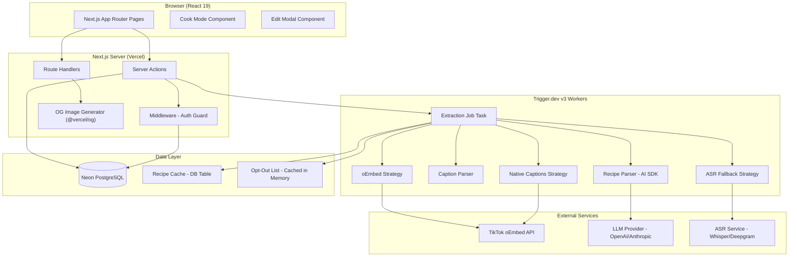
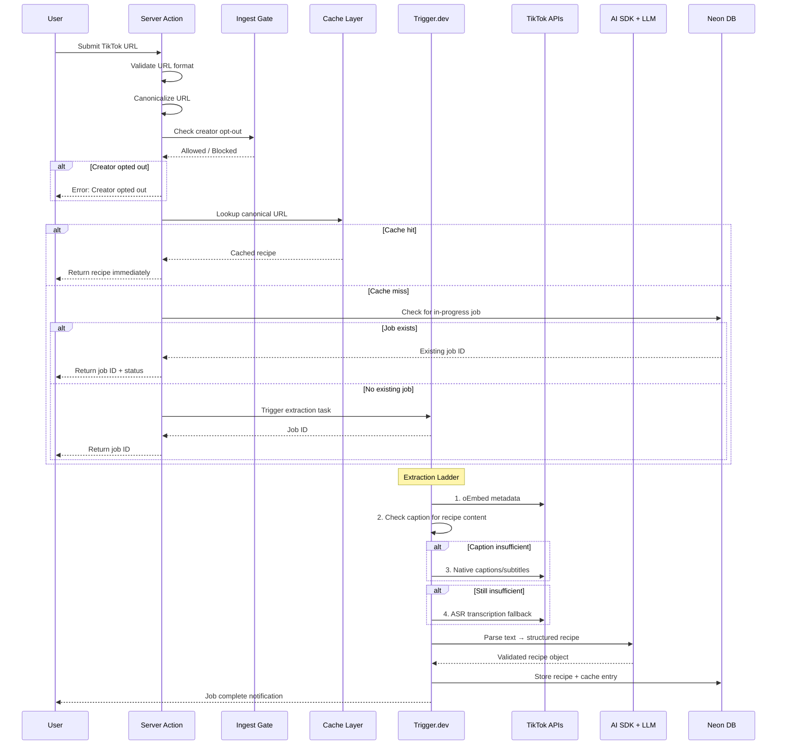
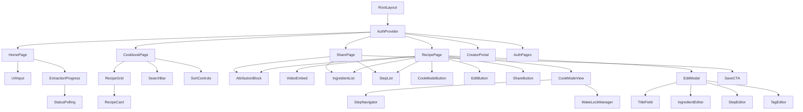
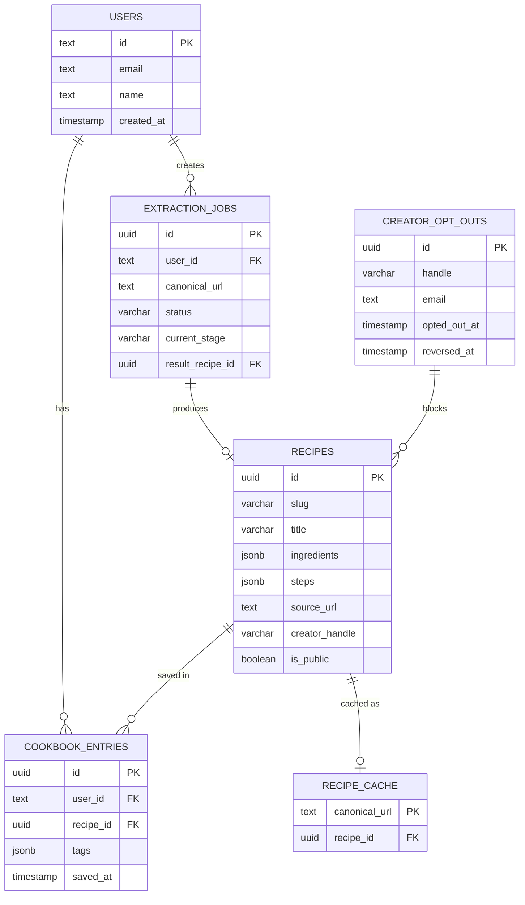
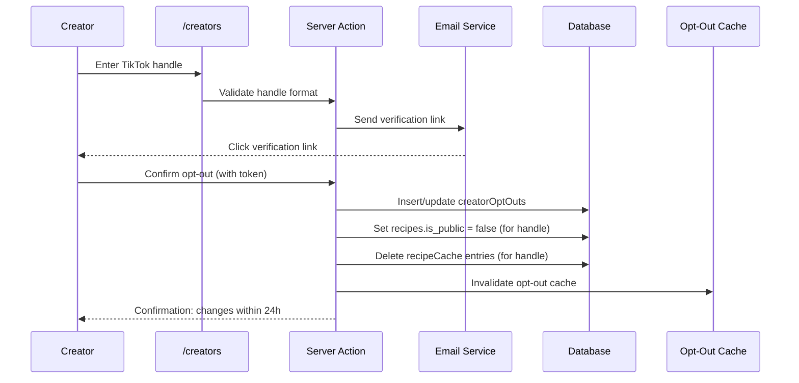

# Technical Design Document: TikTok Recipe App

## Overview

The TikTok Recipe App is a micro-SaaS that extracts structured recipes from TikTok videos using a multi-strategy extraction pipeline backed by LLM parsing. Users paste TikTok URLs, the system resolves video metadata through an "extraction ladder" of progressively more expensive strategies, then structures the raw text into typed recipe objects using the Vercel AI SDK with Zod schemas.

The system is built on Next.js 15 (App Router) with server-side rendering for public share pages, Server Actions for mutations, Trigger.dev v3 for background extraction jobs, Drizzle ORM with Neon PostgreSQL for persistence, and Better-Auth for authentication.

### Key Design Decisions

1. **Extraction as background job**: Extraction can take up to 120s (ASR fallback), so it runs as a Trigger.dev task with real-time status updates via polling or `@trigger.dev/react-hooks`.
2. **Canonical URL as cache key**: All TikTok URL variants resolve to a single canonical form before cache lookup, preventing duplicate extractions.
3. **Opt-out at ingest gate**: Creator opt-out is checked before job creation to avoid wasting compute on blocked content.
4. **Server Actions for mutations**: All write operations (save recipe, edit, tag) use Next.js Server Actions for type-safe, progressive-enhancement-friendly forms.
5. **Slug-based public sharing**: Share pages use short alphanumeric slugs (`/r/[slug]`) for clean, shareable URLs with OG image generation.


## Architecture

### System Architecture Diagram




### Data Flow: URL Submission to Recipe Display



### Route Structure

| Route | Type | Auth | Description |
|-------|------|------|-------------|
| `/` | Page | No | Landing page with URL input |
| `/cookbook` | Page | Yes | Personal recipe collection |
| `/r/[slug]` | Page | No | Public share page (SSR + OG) |
| `/creators` | Page | No | Creator opt-out portal |
| `/auth/signin` | Page | No | Sign-in page |
| `/auth/signup` | Page | No | Sign-up page |
| `/api/auth/[...all]` | Route | — | Better-Auth handler |
| `/api/og/[slug]` | Route | No | OG image generation |
| `/api/extraction/status/[jobId]` | Route | Yes | Polling endpoint for job status |


## Components and Interfaces

### Server Actions

```typescript
// actions/extraction.ts
"use server"

// Validates URL, checks opt-out, triggers extraction job
export async function submitTikTokUrl(url: string): Promise<{
  jobId: string;
  status: ExtractionStatus;
  cachedRecipe?: Recipe;
}>

// actions/cookbook.ts
"use server"

export async function saveRecipeToCookbook(recipeId: string): Promise<void>
export async function removeRecipeFromCookbook(recipeId: string): Promise<void>
export async function updateRecipeTags(
  recipeId: string,
  tags: string[]
): Promise<void>

// actions/recipe.ts
"use server"

export async function updateRecipe(
  recipeId: string,
  data: RecipeEditInput
): Promise<Recipe>

// actions/creator.ts
"use server"

export async function submitOptOutRequest(
  handle: string,
  verificationToken: string
): Promise<void>
export async function reverseOptOut(
  handle: string,
  verificationToken: string
): Promise<void>
```

### Trigger.dev Tasks

```typescript
// trigger/extraction-job.ts
import { task } from "@trigger.dev/sdk/v3";

export const extractionJob = task({
  id: "extraction-job",
  maxDuration: 120, // seconds
  run: async (payload: { url: string; jobId: string; userId: string }) => {
    // 1. oEmbed retrieval (10s timeout)
    // 2. Caption analysis for recipe content
    // 3. Native captions fallback (15s timeout)
    // 4. ASR transcription fallback (60s timeout)
    // 5. LLM parsing via Vercel AI SDK
    // 6. Store result + update cache
  },
});
```

### React Component Hierarchy




### Key Interfaces

```typescript
// lib/types.ts

// Core recipe schema (validated with Zod)
interface Recipe {
  id: string;
  slug: string;               // 8-21 char alphanumeric
  title: string;              // max 200 chars
  ingredients: Ingredient[];  // min 1
  steps: string[];            // min 1, ordered
  sourceUrl: string;          // canonical TikTok URL
  creatorHandle: string;
  creatorDisplayName?: string;
  creatorProfileUrl: string;
  thumbnailUrl?: string;
  extractionStrategy: ExtractionStrategy;
  extractionDurationMs: number;
  createdAt: Date;
  updatedAt: Date;
}

interface Ingredient {
  name: string;               // required
  quantity?: string;          // "2", "a handful", etc.
  unit?: string;             // "cups", "tsp", etc.
}

type ExtractionStrategy = "cache" | "oembed_caption" | "native_captions" | "asr";

interface ExtractionJob {
  id: string;
  url: string;
  canonicalUrl: string;
  userId: string;
  status: ExtractionStatus;
  currentStage: ExtractionStage;
  strategiesAttempted: StrategyAttempt[];
  result?: Recipe;
  error?: ExtractionError;
  createdAt: Date;
  updatedAt: Date;
}

type ExtractionStatus = "pending" | "processing" | "completed" | "failed" | "timed_out";
type ExtractionStage = "cache_lookup" | "oembed" | "caption_parse" | "native_captions" | "asr" | "llm_parse" | "complete";

interface StrategyAttempt {
  strategy: ExtractionStrategy;
  success: boolean;
  durationMs: number;
  error?: string;
}

interface ExtractionError {
  code: string;
  message: string;
  strategiesAttempted: StrategyAttempt[];
}
```


## Data Models

### Database Schema (Drizzle ORM)

```typescript
// db/schema.ts
import { pgTable, text, timestamp, integer, jsonb, boolean, varchar, uuid, index } from "drizzle-orm/pg-core";

// ─── Users ───────────────────────────────────────────────────────────────────
export const users = pgTable("users", {
  id: text("id").primaryKey(),  // Better-Auth manages this
  name: text("name"),
  email: text("email").notNull().unique(),
  emailVerified: boolean("email_verified").notNull().default(false),
  image: text("image"),
  createdAt: timestamp("created_at").notNull().defaultNow(),
  updatedAt: timestamp("updated_at").notNull().defaultNow(),
});

// Better-Auth session/account tables are auto-managed by the library

// ─── Recipes ─────────────────────────────────────────────────────────────────
export const recipes = pgTable("recipes", {
  id: uuid("id").primaryKey().defaultRandom(),
  slug: varchar("slug", { length: 21 }).notNull().unique(),
  title: varchar("title", { length: 200 }).notNull(),
  ingredients: jsonb("ingredients").notNull().$type<Ingredient[]>(),
  steps: jsonb("steps").notNull().$type<string[]>(),
  sourceUrl: text("source_url").notNull(),              // canonical TikTok URL
  creatorHandle: varchar("creator_handle", { length: 24 }).notNull(),
  creatorDisplayName: text("creator_display_name"),
  creatorProfileUrl: text("creator_profile_url").notNull(),
  thumbnailUrl: text("thumbnail_url"),
  extractionStrategy: varchar("extraction_strategy", { length: 20 }).notNull(),
  extractionDurationMs: integer("extraction_duration_ms").notNull(),
  isPublic: boolean("is_public").notNull().default(true), // false when creator opts out
  createdAt: timestamp("created_at").notNull().defaultNow(),
  updatedAt: timestamp("updated_at").notNull().defaultNow(),
}, (table) => [
  index("idx_recipes_slug").on(table.slug),
  index("idx_recipes_source_url").on(table.sourceUrl),
  index("idx_recipes_creator_handle").on(table.creatorHandle),
]);

// ─── Cookbook (User-Recipe junction) ─────────────────────────────────────────
export const cookbookEntries = pgTable("cookbook_entries", {
  id: uuid("id").primaryKey().defaultRandom(),
  userId: text("user_id").notNull().references(() => users.id, { onDelete: "cascade" }),
  recipeId: uuid("recipe_id").notNull().references(() => recipes.id, { onDelete: "cascade" }),
  tags: jsonb("tags").notNull().default([]).$type<string[]>(),
  savedAt: timestamp("saved_at").notNull().defaultNow(),
}, (table) => [
  index("idx_cookbook_user").on(table.userId),
  index("idx_cookbook_user_recipe").on(table.userId, table.recipeId).unique(),
]);

// ─── Extraction Jobs ─────────────────────────────────────────────────────────
export const extractionJobs = pgTable("extraction_jobs", {
  id: uuid("id").primaryKey().defaultRandom(),
  userId: text("user_id").notNull().references(() => users.id),
  url: text("url").notNull(),
  canonicalUrl: text("canonical_url").notNull(),
  status: varchar("status", { length: 20 }).notNull().default("pending"),
  currentStage: varchar("current_stage", { length: 20 }),
  strategiesAttempted: jsonb("strategies_attempted").default([]).$type<StrategyAttempt[]>(),
  resultRecipeId: uuid("result_recipe_id").references(() => recipes.id),
  error: jsonb("error").$type<ExtractionError>(),
  triggerJobId: text("trigger_job_id"),    // Trigger.dev run ID
  createdAt: timestamp("created_at").notNull().defaultNow(),
  updatedAt: timestamp("updated_at").notNull().defaultNow(),
}, (table) => [
  index("idx_jobs_canonical_url").on(table.canonicalUrl),
  index("idx_jobs_user").on(table.userId),
  index("idx_jobs_status").on(table.status),
]);

// ─── Recipe Cache ────────────────────────────────────────────────────────────
export const recipeCache = pgTable("recipe_cache", {
  canonicalUrl: text("canonical_url").primaryKey(),
  recipeId: uuid("recipe_id").notNull().references(() => recipes.id, { onDelete: "cascade" }),
  createdAt: timestamp("created_at").notNull().defaultNow(),
});

// ─── Creator Opt-Out ─────────────────────────────────────────────────────────
export const creatorOptOuts = pgTable("creator_opt_outs", {
  id: uuid("id").primaryKey().defaultRandom(),
  handle: varchar("handle", { length: 24 }).notNull().unique(),
  email: text("email").notNull(),
  verifiedAt: timestamp("verified_at"),
  optedOutAt: timestamp("opted_out_at").notNull().defaultNow(),
  reversedAt: timestamp("reversed_at"),           // null = actively opted out
  createdAt: timestamp("created_at").notNull().defaultNow(),
}, (table) => [
  index("idx_optout_handle").on(table.handle),
]);
```


### Entity Relationship Diagram



### URL Canonicalization Logic

TikTok URLs come in multiple formats that must resolve to a single canonical form:

```typescript
// lib/url.ts

const TIKTOK_PATTERNS = [
  // Long-form: tiktok.com/@user/video/1234567890
  /^(?:https?:\/\/)?(?:www\.)?tiktok\.com\/@([\w.]+)\/video\/(\d+)/,
  // Short-form: vm.tiktok.com/ABC123
  /^(?:https?:\/\/)?vm\.tiktok\.com\/([\w]+)/,
  // Mobile share: tiktok.com/t/ABC123
  /^(?:https?:\/\/)?(?:www\.)?tiktok\.com\/t\/([\w]+)/,
];

export function validateTikTokUrl(url: string): boolean {
  if (url.length > 2048) return false;
  return TIKTOK_PATTERNS.some(pattern => pattern.test(url));
}

export async function canonicalizeTikTokUrl(url: string): Promise<string> {
  // For short/mobile links: follow redirect to get canonical long-form URL
  // For long-form: strip query params, normalize to https://www.tiktok.com/@user/video/id
  // Returns: "https://www.tiktok.com/@{user}/video/{id}"
}
```


### Extraction Ladder Implementation

The extraction ladder is a sequential strategy chain with increasing cost/latency:

```typescript
// trigger/strategies/index.ts

interface StrategyResult {
  text: string;
  strategy: ExtractionStrategy;
  durationMs: number;
}

// Strategy 1: oEmbed caption check
async function tryOembedCaption(canonicalUrl: string): Promise<StrategyResult | null> {
  // GET https://www.tiktok.com/oembed?url={canonicalUrl}
  // Response: { title, author_name, author_url, html, thumbnail_url, ... }
  // Check if 'title' (which is the caption) contains recipe indicators:
  //   - At least one ingredient quantity (number + unit pattern)
  //   - At least one action verb from a curated list
  // Timeout: 10 seconds
}

// Strategy 2: Native captions (subtitles)
async function tryNativeCaptions(canonicalUrl: string): Promise<StrategyResult | null> {
  // Attempt to fetch video subtitle/caption tracks
  // Parse VTT/SRT format into plain text
  // Check for recipe content criteria
  // Timeout: 15 seconds
}

// Strategy 3: ASR fallback
async function tryAsrTranscription(canonicalUrl: string): Promise<StrategyResult | null> {
  // Extract audio from video
  // Send to ASR service (Whisper API or Deepgram)
  // Timeout: 60 seconds
}

// Orchestrator
export async function runExtractionLadder(
  canonicalUrl: string,
  jobId: string
): Promise<{ text: string; strategy: ExtractionStrategy; attempts: StrategyAttempt[] }> {
  const attempts: StrategyAttempt[] = [];

  // Try each strategy in order, recording attempts
  for (const strategy of [tryOembedCaption, tryNativeCaptions, tryAsrTranscription]) {
    const result = await strategy(canonicalUrl);
    attempts.push({ strategy: result?.strategy, success: !!result, durationMs: result?.durationMs ?? 0 });
    if (result) return { ...result, attempts };
  }

  throw new ExtractionFailedError(attempts);
}
```

### LLM Recipe Parsing (Vercel AI SDK)

```typescript
// lib/recipe-parser.ts
import { generateObject } from "ai";
import { z } from "zod";
import { openai } from "@ai-sdk/openai";

export const ingredientSchema = z.object({
  name: z.string().min(1),
  quantity: z.string().optional(),
  unit: z.string().optional(),
});

export const recipeSchema = z.object({
  title: z.string().min(1).max(200),
  ingredients: z.array(ingredientSchema).min(1),
  steps: z.array(z.string().min(1)).min(1),
});

export type RecipeOutput = z.infer<typeof recipeSchema>;

export async function parseRecipeFromText(text: string): Promise<RecipeOutput> {
  if (text.length > 50_000) {
    throw new TextTooLongError(text.length);
  }

  const { object } = await generateObject({
    model: openai("gpt-4o-mini"),
    schema: recipeSchema,
    prompt: `Extract a structured recipe from this TikTok video transcript/caption. 
             Identify the recipe title, all ingredients with quantities and units where 
             possible, and ordered preparation steps.
             
             Source text:
             ${text}`,
  });

  return object;
}
```


### Background Job Architecture (Trigger.dev v3)

```typescript
// trigger/extraction-job.ts
import { task, metadata } from "@trigger.dev/sdk/v3";
import { runExtractionLadder } from "./strategies";
import { parseRecipeFromText } from "@/lib/recipe-parser";
import { db } from "@/db";
import { extractionJobs, recipes, recipeCache } from "@/db/schema";
import { eq } from "drizzle-orm";
import { generateSlug } from "@/lib/slug";

export const extractionJob = task({
  id: "extraction-job",
  maxDuration: 120,
  retry: { maxAttempts: 1 }, // No retries - ladder handles internal failures
  run: async (payload: {
    jobId: string;
    canonicalUrl: string;
    userId: string;
    creatorHandle: string;
    creatorDisplayName?: string;
    creatorProfileUrl: string;
    thumbnailUrl?: string;
  }) => {
    const { jobId, canonicalUrl } = payload;

    try {
      // Update status to processing
      await updateJobStatus(jobId, "processing", "oembed");

      // Run the extraction ladder
      const { text, strategy, attempts } = await runExtractionLadder(canonicalUrl, jobId);

      // Update stage to LLM parsing
      await updateJobStatus(jobId, "processing", "llm_parse");

      // Parse with LLM
      const parsed = await parseRecipeFromText(text);

      // Create recipe record
      const slug = generateSlug();
      const [recipe] = await db.insert(recipes).values({
        slug,
        title: parsed.title,
        ingredients: parsed.ingredients,
        steps: parsed.steps,
        sourceUrl: canonicalUrl,
        creatorHandle: payload.creatorHandle,
        creatorDisplayName: payload.creatorDisplayName,
        creatorProfileUrl: payload.creatorProfileUrl,
        thumbnailUrl: payload.thumbnailUrl,
        extractionStrategy: strategy,
        extractionDurationMs: attempts.reduce((sum, a) => sum + a.durationMs, 0),
      }).returning();

      // Cache the result
      await db.insert(recipeCache).values({
        canonicalUrl,
        recipeId: recipe.id,
      }).onConflictDoNothing();

      // Mark job complete
      await db.update(extractionJobs)
        .set({
          status: "completed",
          currentStage: "complete",
          strategiesAttempted: attempts,
          resultRecipeId: recipe.id,
          updatedAt: new Date(),
        })
        .where(eq(extractionJobs.id, jobId));

      return { recipeId: recipe.id, slug };
    } catch (error) {
      await db.update(extractionJobs)
        .set({
          status: "failed",
          error: { code: "EXTRACTION_FAILED", message: error.message, strategiesAttempted: [] },
          updatedAt: new Date(),
        })
        .where(eq(extractionJobs.id, jobId));
      throw error;
    }
  },
});
```

### Job Status Polling

The client polls for extraction status using a route handler:

```typescript
// app/api/extraction/status/[jobId]/route.ts
import { NextResponse } from "next/server";
import { db } from "@/db";
import { extractionJobs } from "@/db/schema";
import { eq } from "drizzle-orm";
import { auth } from "@/lib/auth";

export async function GET(
  request: Request,
  { params }: { params: { jobId: string } }
) {
  const session = await auth.api.getSession({ headers: request.headers });
  if (!session) return NextResponse.json({ error: "Unauthorized" }, { status: 401 });

  const [job] = await db.select()
    .from(extractionJobs)
    .where(eq(extractionJobs.id, params.jobId));

  if (!job || job.userId !== session.user.id) {
    return NextResponse.json({ error: "Not found" }, { status: 404 });
  }

  return NextResponse.json({
    status: job.status,
    currentStage: job.currentStage,
    resultRecipeId: job.resultRecipeId,
    error: job.error,
  });
}
```


### Authentication Flow (Better-Auth)

```typescript
// lib/auth.ts
import { betterAuth } from "better-auth";
import { drizzleAdapter } from "better-auth/adapters/drizzle";
import { db } from "@/db";

export const auth = betterAuth({
  database: drizzleAdapter(db, { provider: "pg" }),
  emailAndPassword: {
    enabled: true,
    minPasswordLength: 8,
    maxPasswordLength: 128,
  },
  socialProviders: {
    google: {
      clientId: process.env.GOOGLE_CLIENT_ID!,
      clientSecret: process.env.GOOGLE_CLIENT_SECRET!,
    },
  },
  session: {
    expiresIn: 60 * 60 * 24 * 30, // 30 days
    updateAge: 60 * 60 * 24,       // refresh daily
  },
});

// lib/auth-client.ts (client-side)
import { createAuthClient } from "better-auth/react";

export const authClient = createAuthClient({
  baseURL: process.env.NEXT_PUBLIC_APP_URL,
});
```

### Auth Middleware (Protected Routes)

```typescript
// middleware.ts
import { betterAuth } from "better-auth";
import { NextResponse } from "next/server";
import type { NextRequest } from "next/server";

const PROTECTED_ROUTES = ["/cookbook", "/api/extraction"];

export async function middleware(request: NextRequest) {
  const { pathname } = request.nextUrl;

  if (PROTECTED_ROUTES.some(route => pathname.startsWith(route))) {
    // Better-Auth session check via cookie
    const sessionCookie = request.cookies.get("better-auth.session_token");
    if (!sessionCookie) {
      const signInUrl = new URL("/auth/signin", request.url);
      signInUrl.searchParams.set("callbackUrl", pathname);
      return NextResponse.redirect(signInUrl);
    }
  }

  return NextResponse.next();
}

export const config = {
  matcher: ["/cookbook/:path*", "/api/extraction/:path*"],
};
```


### Caching Strategy

The app uses a multi-layer caching approach:

| Layer | What | TTL | Invalidation |
|-------|------|-----|--------------|
| **Recipe Cache (DB)** | Extracted recipes keyed by canonical URL | Indefinite | Creator opt-out removes entries |
| **Opt-Out List (Memory)** | Set of opted-out creator handles | 5 minutes | Auto-refresh on expiry |
| **Next.js ISR** | Public share pages (`/r/[slug]`) | 1 hour | `revalidatePath` on edit/opt-out |
| **OG Images** | Generated OG images | CDN edge cache | Purged on recipe title change |

```typescript
// lib/opt-out-cache.ts

let optOutCache: { handles: Set<string>; fetchedAt: number } | null = null;
const MAX_STALENESS_MS = 5 * 60 * 1000; // 5 minutes

export async function isCreatorOptedOut(handle: string): Promise<boolean> {
  const cache = await getOptOutCache();
  return cache.has(handle.toLowerCase());
}

async function getOptOutCache(): Promise<Set<string>> {
  const now = Date.now();

  if (optOutCache && (now - optOutCache.fetchedAt) < MAX_STALENESS_MS) {
    return optOutCache.handles;
  }

  try {
    const rows = await db.select({ handle: creatorOptOuts.handle })
      .from(creatorOptOuts)
      .where(isNull(creatorOptOuts.reversedAt));

    optOutCache = {
      handles: new Set(rows.map(r => r.handle.toLowerCase())),
      fetchedAt: now,
    };
    return optOutCache.handles;
  } catch (error) {
    // If DB unavailable, use stale cache (Requirement 11.5)
    if (optOutCache) return optOutCache.handles;
    throw error;
  }
}
```

### Creator Opt-Out System Design



**Opt-out effects:**
1. `creatorOptOuts` table records the handle with `opted_out_at` timestamp
2. All `recipes` for that handle get `is_public = false`
3. All `recipeCache` entries for that handle are deleted
4. Share pages (`/r/[slug]`) show "Creator opted out" for affected recipes
5. Cookbook entries remain but display an opt-out notice
6. Future extraction attempts for that creator are blocked at the ingest gate

**Opt-out reversal:**
1. Sets `reversed_at` timestamp on the `creatorOptOuts` record
2. Restores `is_public = true` on affected recipes
3. Opt-out cache refreshes within 5 minutes


### OG Image Generation

```typescript
// app/api/og/[slug]/route.tsx
import { ImageResponse } from "@vercel/og";
import { db } from "@/db";
import { recipes } from "@/db/schema";
import { eq } from "drizzle-orm";

export const runtime = "edge";

export async function GET(
  request: Request,
  { params }: { params: { slug: string } }
) {
  const [recipe] = await db.select({ title: recipes.title })
    .from(recipes)
    .where(eq(recipes.slug, params.slug));

  if (!recipe) {
    return new Response("Not found", { status: 404 });
  }

  return new ImageResponse(
    (
      <div style={{
        width: 1200,
        height: 630,
        display: "flex",
        flexDirection: "column",
        alignItems: "center",
        justifyContent: "center",
        background: "linear-gradient(135deg, #667eea 0%, #764ba2 100%)",
        padding: 60,
      }}>
        <div style={{ fontSize: 64, fontWeight: 700, color: "white", textAlign: "center" }}>
          {recipe.title}
        </div>
        <div style={{ fontSize: 28, color: "rgba(255,255,255,0.8)", marginTop: 20 }}>
          Extracted from TikTok • RecipeApp
        </div>
      </div>
    ),
    { width: 1200, height: 630 }
  );
}
```

### Slug Generation

```typescript
// lib/slug.ts
import { customAlphabet } from "nanoid";

// 8-21 char alphanumeric slug
const generateId = customAlphabet("abcdefghijklmnopqrstuvwxyz0123456789", 12);

export function generateSlug(): string {
  return generateId(); // 12 chars, within 8-21 range
}
```


## Correctness Properties

*A property is a characteristic or behavior that should hold true across all valid executions of a system — essentially, a formal statement about what the system should do. Properties serve as the bridge between human-readable specifications and machine-verifiable correctness guarantees.*

### Property 1: TikTok URL Validation Correctness

*For any* string that matches a valid TikTok video URL pattern (long-form `tiktok.com/@{user}/video/{id}`, short-form `vm.tiktok.com/{shortcode}`, or mobile `tiktok.com/t/{shortcode}`) with or without `https://www` prefix and regardless of trailing query parameters, the URL validator SHALL accept it; and *for any* string that does not match any of these patterns OR exceeds 2048 characters, the validator SHALL reject it.

**Validates: Requirements 1.1, 1.2, 1.6**

### Property 2: Recipe Content Detection

*For any* text string containing at least one ingredient quantity (a numeric value or measurement word) AND at least one action verb from the recipe verb set (e.g., "mix", "bake", "chop", "stir"), the recipe content detector SHALL return true; and *for any* text lacking either component, it SHALL return false.

**Validates: Requirements 2.3**

### Property 3: Parser Output Structural Validity

*For any* text input that the Recipe_Parser successfully processes (does not return an error), the output object SHALL have a title of 1-200 characters, an ingredients array with at least 1 element where each element has a non-empty `name` field, and a steps array with at least 1 element — all conforming to the Zod recipe schema.

**Validates: Requirements 3.1, 3.2, 3.3**

### Property 4: Recipe Serialization Round-Trip

*For any* valid Recipe object (conforming to the Zod schema with arbitrary title, ingredients list with optional quantity/unit fields, and ordered steps array), serializing to JSON and then deserializing back SHALL produce a deeply equal object preserving array ordering, numeric precision of quantities, and presence or absence of optional fields.

**Validates: Requirements 3.6, 14.1, 14.2, 14.3**

### Property 5: Deserialization Error Handling

*For any* string that is either not valid JSON, or is valid JSON but does not conform to the recipe Zod schema (missing required fields, wrong types, or constraint violations), the deserializer SHALL return a structured error object indicating the specific validation failures — never a partial object, never an unhandled exception.

**Validates: Requirements 14.4, 14.5**

### Property 6: Cookbook Save Idempotence

*For any* authenticated user and any recipe, saving that recipe to the cookbook N times (where N >= 1) SHALL result in exactly 1 cookbook entry for that user-recipe pair. Subsequent saves after the first SHALL return an "already saved" indication without creating duplicates.

**Validates: Requirements 6.2**

### Property 7: Cookbook Default Sort Order

*For any* set of cookbook entries belonging to a user, the default listing order SHALL be strictly descending by `savedAt` timestamp — that is, for every adjacent pair in the result list, the earlier entry's `savedAt` SHALL be greater than or equal to the later entry's `savedAt`.

**Validates: Requirements 6.3**

### Property 8: Cookbook Search Relevance

*For any* search query string and any set of cookbook entries, every recipe returned in the search results SHALL contain the query string (case-insensitive) in at least one of: the recipe title, an ingredient name, or a tag. No recipe matching none of these fields SHALL appear in results.

**Validates: Requirements 6.4**

### Property 9: Tag Validation Constraints

*For any* string exceeding 50 characters, adding it as a tag to a recipe SHALL be rejected. *For any* recipe that already has 20 tags, adding an additional tag SHALL be rejected. *For any* valid tag string (1-50 characters), adding it to a recipe with fewer than 20 tags SHALL succeed.

**Validates: Requirements 6.5**

### Property 10: Edit Input Validation

*For any* edit submission, validation SHALL accept the input if and only if the title is non-empty and at most 200 characters, at least one ingredient is present with a non-empty name, and at least one non-empty step is present. All other inputs SHALL produce field-level validation errors.

**Validates: Requirements 7.2, 7.3**

### Property 11: URL Canonicalization Determinism

*For any* TikTok video identified by a specific video ID, all URL variants pointing to that video (long-form with different query params, short-form, mobile share link) SHALL canonicalize to the identical canonical URL string. Canonicalization SHALL be idempotent: `canonicalize(canonicalize(url)) === canonicalize(url)`.

**Validates: Requirements 13.1, 13.4**

### Property 12: TikTok Handle Format Validation

*For any* string consisting only of alphanumeric characters and underscores with length 1-24, the handle validator SHALL accept it. *For any* string that contains other characters, is empty, or exceeds 24 characters, the validator SHALL reject it.

**Validates: Requirements 10.8**


## Error Handling

### Error Classification

| Error Type | HTTP Status | User-Facing Message | Recovery |
|-----------|-------------|---------------------|----------|
| Invalid URL format | 400 | "Please enter a valid TikTok video URL" | User corrects input |
| URL too long | 400 | "URL exceeds maximum length" | User shortens URL |
| Creator opted out | 403 | "This creator has opted out of recipe extraction" | None |
| Creator not resolvable | 400 | "Could not identify the video creator" | User tries different URL |
| Extraction timeout | 504 | "Extraction took too long. Please try again later" | Retry |
| All strategies failed | 502 | "Could not extract recipe from this video" | Show which strategies were tried |
| LLM parse failure | 422 | "Could not identify a recipe in this video" | Show raw text option |
| Text too long | 400 | "Video transcript exceeds processing limit" | None |
| Auth required | 401 | Redirect to sign-in | User authenticates |
| Recipe not found | 404 | "Recipe not found" | None |
| Save failed | 500 | "Could not save. Please try again" | Retry |
| Edit validation | 422 | Field-level error indicators | User corrects fields |

### Error Response Structure

```typescript
// lib/errors.ts

interface AppError {
  code: string;
  message: string;
  details?: Record<string, string>;  // field-level errors for validation
}

// Server Action error pattern
export function createError(code: string, message: string, details?: Record<string, string>): AppError {
  return { code, message, details };
}

// Example usage in Server Actions
export async function submitTikTokUrl(url: string) {
  if (!validateTikTokUrl(url)) {
    return { error: createError("INVALID_URL", "Please enter a valid TikTok video URL") };
  }
  if (url.length > 2048) {
    return { error: createError("URL_TOO_LONG", "URL exceeds the maximum allowed length") };
  }
  // ...
}
```

### Extraction Job Failure Handling

```typescript
// When all strategies fail, the error includes strategy details
interface ExtractionFailureError extends AppError {
  code: "EXTRACTION_FAILED";
  strategiesAttempted: Array<{
    strategy: string;
    error: string;
    durationMs: number;
  }>;
}
```

### Graceful Degradation

- **TikTok embed fails**: Show fallback link to original video (Req 4.2)
- **Wake-lock unsupported**: Show Cook Mode without wake-lock + notice (Req 5.5)
- **Wake-lock released by OS**: Re-acquire on visibility change (Req 5.6)
- **Opt-out cache unavailable**: Use stale cache (Req 11.5)
- **OG image generation fails**: Return generic fallback image
- **Cache entry invalid**: Discard and re-extract (Req 13.5)


## Testing Strategy

### Property-Based Testing

This feature has significant pure-function logic (URL validation, recipe parsing, serialization, search filtering) that benefits from property-based testing. We'll use [fast-check](https://github.com/dubzzz/fast-check) as the PBT library for TypeScript.

**Configuration:**
- Minimum 100 iterations per property test
- Each test tagged with: `Feature: tiktok-recipe-app, Property {N}: {title}`

**Properties to implement:**

| # | Property | Module Under Test |
|---|----------|-------------------|
| 1 | URL validation correctness | `lib/url.ts` → `validateTikTokUrl` |
| 2 | Recipe content detection | `lib/recipe-detection.ts` → `hasRecipeContent` |
| 3 | Parser output structural validity | `lib/recipe-parser.ts` → `parseRecipeFromText` |
| 4 | Serialization round-trip | `lib/recipe-serializer.ts` → `serialize`/`deserialize` |
| 5 | Deserialization error handling | `lib/recipe-serializer.ts` → `deserialize` |
| 6 | Cookbook save idempotence | `actions/cookbook.ts` → `saveRecipeToCookbook` |
| 7 | Cookbook default sort order | `lib/cookbook-queries.ts` → `getUserCookbook` |
| 8 | Cookbook search relevance | `lib/cookbook-queries.ts` → `searchCookbook` |
| 9 | Tag validation constraints | `lib/validation.ts` → `validateTag` |
| 10 | Edit input validation | `lib/validation.ts` → `validateRecipeEdit` |
| 11 | URL canonicalization determinism | `lib/url.ts` → `canonicalizeTikTokUrl` |
| 12 | Handle format validation | `lib/validation.ts` → `validateTikTokHandle` |

**Generator Strategy:**
- URL generators: produce valid TikTok URLs by combining random usernames, video IDs, prefixes, and query params
- Recipe generators: produce valid Recipe objects with random titles (1-200 chars), ingredient lists (1-20 items), and step lists (1-30 items)
- Tag generators: random strings of varying lengths to test boundary conditions
- Search generators: pick a random field value from a generated recipe set as the query

### Unit Tests

Specific example-based tests for:
- Extraction ladder strategy ordering (mock each strategy)
- Job status transitions
- Auth flow redirects
- Cook Mode step navigation
- Edit modal form behavior
- OG meta tag rendering
- Creator opt-out workflow (verify DB state changes)
- Share page 404 handling

### Integration Tests

- Full extraction flow (URL → job → recipe) with mocked TikTok API
- Authentication roundtrip (sign-up, sign-in, sign-out)
- Cookbook save → retrieve → search → delete flow
- Creator opt-out → verify extraction blocked → reverse → verify unblocked
- Cache hit path timing (< 500ms)

### E2E Tests

- Submit URL → wait for extraction → view recipe page
- Sign in → save recipe → view in cookbook → edit → share
- Creator submits opt-out → verify share page shows notice

### Test Infrastructure

```
tests/
├── properties/          # fast-check property tests
│   ├── url.property.test.ts
│   ├── recipe-parser.property.test.ts
│   ├── serialization.property.test.ts
│   ├── cookbook.property.test.ts
│   ├── validation.property.test.ts
│   └── generators/     # shared fast-check arbitraries
│       ├── url.gen.ts
│       ├── recipe.gen.ts
│       └── cookbook.gen.ts
├── unit/               # example-based unit tests
├── integration/        # API + DB integration tests
└── e2e/               # Playwright E2E tests
```
